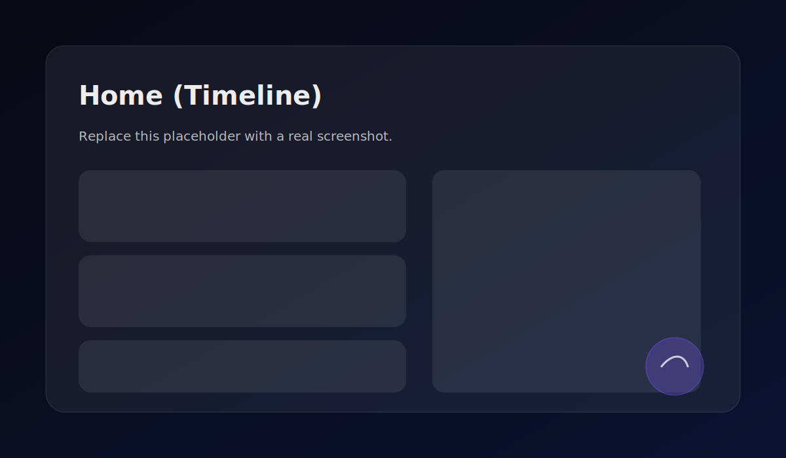
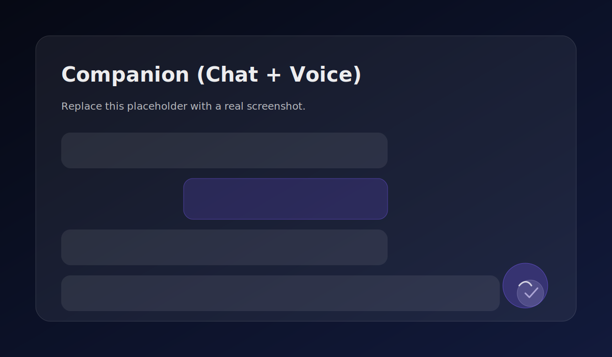
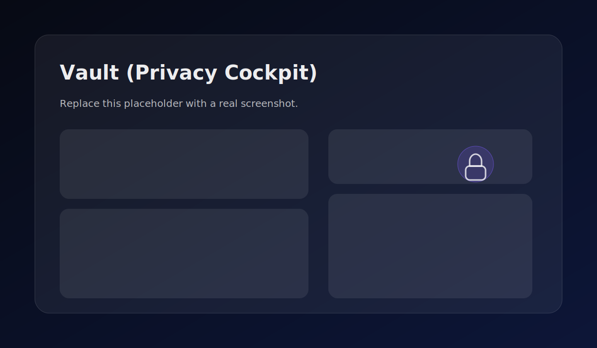

# WellnessOS (HygieiaOS)

Free, voice‑first wellness companion PWA with offline hygiene Q&A + encrypted vault.

[](https://github.com/dhyeysanghvi15/HygieiaOS/actions/workflows/ci.yml)
[](https://github.com/dhyeysanghvi15/HygieiaOS/actions/workflows/codeql.yml)
[](https://github.com/dhyeysanghvi15/HygieiaOS/actions/workflows/pages.yml)

WellnessOS is a static, installable, offline‑capable Progressive Web App I built to help me stay consistent with hygiene + wellness habits without giving up privacy. It has a persistent **Companion Console** (type or speak), **timers + routines**, an **offline Hygiene Knowledge Pack with citations**, and a **cybersecurity‑grade local vault** for anything sensitive.

Important: this is a student prototype and not a medical device. It’s designed to be safety‑first, not “therapeutic.”

## Why I built this (student story)

- I kept falling off basic routines when school got busy, so I wanted an app that nudges gently without being annoying.
- I wanted hygiene guidance that still works on a bad Wi‑Fi day (offline knowledge pack + citations).
- I wanted a voice‑first flow that feels quick on mobile (push‑to‑talk, transcript preview).
- I didn’t want my journal/check‑ins/chat history going to someone else’s server — so I built a local encrypted vault.
- I wanted to learn real security engineering patterns (WebCrypto, hash chains, threat model, CI security checks).
- Everything is free to run and free to use (no paid APIs).

## Quick demo (60 seconds)

1) Start the app and land on **Home (Timeline)**.
2) Tap the floating **Companion Orb** (bottom-right) to open the **Companion Dock**.
3) Type: `2-minute rescue` → run the quick routine.
4) Go to **Tools** → start the **Brush timer (2 min)**.
5) Go back to Companion and ask: “How long should I wash my hands?” → see an answer with **citations** + **Last updated**.
6) Go to **Vault** → set a passcode → verify **Encryption status** and tap **Verify integrity**.

## Features

### Companion (chat + voice + actions)

- Persistent companion dock (collapsed) + expanded chat drawer.
- Typing with suggestion chips and slash commands (examples: `/morning`, `/sleep`, `/focus 25`, `/hydrate`).
- Push‑to‑talk voice input with transcript preview (falls back to typing if voice isn’t supported).
- Optional text‑to‑speech replies (toggleable).
- Action cards under replies (start timer, mark done, snooze).
- Optional **Smart Mode** (local in‑browser model via WebLLM) when available; otherwise runs **Core Mode** (deterministic tool‑based engine).

### Wellness OS (timeline, routines, timers)

- Daily timeline with checkpoints (Morning/Day/Evening/Bedtime).
- Timers: brush (2 min), handwash (20 sec), breathing, focus (Pomodoro).
- Routine wizards + custom routines.
- “2‑minute rescue” quick routine.

### Mental support (check‑ins + grounding)

- Mood/stress/energy check‑ins.
- Grounding‑style prompts and “keep it small” support when needed.
- Risk‑tier gating (see Safety Policy below).

### Hygiene Q&A (offline knowledge pack + citations)

- Ships with a curated offline index at `public/knowledge/index.json`.
- Retrieval + answer generation with citations (URL + title + last updated).
- Optional Live Web Mode (OFF by default) for web-sourced answers with explicit labeling and citations.

### Cybersecurity (vault, integrity, export/delete/lock)

- Local encrypted vault (AES‑GCM) with passcode‑derived key (PBKDF2) option.
- Tamper‑evident ledger (hash chain) + “Verify integrity” to detect modifications.
- Export encrypted backup (`.json.enc`) and delete‑everything flow.
- Privacy Lock controls for sensitive views.

### UI/UX

- Midnight glass design system, responsive layout (mobile + desktop).
- Command palette (`Ctrl+K`) for quick actions.
- Framer Motion transitions + microinteractions.
- Keyboard‑friendly navigation and accessible tap targets.

## Cybersecurity & privacy

This app is local‑first: by default it’s a static site with no backend server.

### What’s encrypted (and what you can disable)

In the Vault screen, you can control whether to store:
- Chat history
- Voice transcripts
- Journals / check‑ins (if enabled)

When storage is enabled, sensitive data is encrypted and stored in IndexedDB via Dexie.

### How encryption works (high level)

- **AES‑GCM** encrypts payloads.
- If you set a passcode, a key is derived using **PBKDF2 + salt + high iteration count**.
- If you don’t set a passcode, the app can use a device key mode (still encrypted, but passcode is recommended).

### Tamper‑evident ledger (hash chain)

Every vault entry links to the previous entry hash. “Verify integrity” walks the chain and reports where it breaks if anything was changed.

### Export / delete controls

- Export generates an encrypted `.json.enc` payload for download (copy‑out, no auto sending).
- Delete wipes local vault state (with an explicit confirmation flow).

### Security guarantees & limitations

- Static hosts (like GitHub Pages) can’t always set strict security headers; some hosts can (see optional production headers guidance in the repo).
- Voice recognition uses browser APIs; availability varies by browser/OS. If you enable storing transcripts, they’re encrypted when stored.

More detail:
- `SECURITY.md`
- `THREAT_MODEL.md`
- `PRIVACY.md`

## Safety policy (Green / Yellow / Orange / Red)

The companion always scores user messages before responding and applies strict rules:

- **Green**: normal supportive coaching + tools.
- **Yellow**: less theorizing, more grounding + encourage support.
- **Orange**: minimal coaching, emphasize human help, offer message templates.
- **Red**: short, calm crisis‑style response; no “therapy improvisation,” encourages real‑world help and safety check‑ins.

If you’re in immediate danger or might hurt yourself, use your local emergency number or local crisis resources (and consider contacting someone you trust right now).

Policy details: `SAFETY_POLICY.md`

## Tech stack (what I learned / used)

- App: Vite + React + TypeScript
- UI: TailwindCSS, shadcn/ui (Radix), Framer Motion, lucide-react
- State + schema: Zustand, Zod
- Storage: IndexedDB (Dexie) + WebCrypto (AES‑GCM, PBKDF2)
- Testing: Vitest + Testing Library, Playwright (E2E smoke)
- DevOps/security: GitHub Actions CI, CodeQL, Dependabot
- Optional local model: `@mlc-ai/web-llm` (Smart Mode)

## Repo structure (student-friendly map)

Key folders:

- `src/app/layout/` — app shell, responsive layout, dock behavior
- `src/components/companion/` — companion UI (orb, dock, chat thread, voice overlay)
- `src/features/companion/` — companion engine, tool routing, safety policy
- `src/features/vault/` — encryption, Dexie storage, ledger, export helpers
- `src/features/knowledge/` — offline knowledge loading, retrieval, answer builder + citations
- `scripts/knowledge/` — knowledge pack builder + extraction utilities + guardrails
- `.github/workflows/` — CI, CodeQL, Pages deploy, knowledge refresh

Key entry points:
- `src/main.tsx` — React bootstrap
- `src/App.tsx` — routing root
- `src/app/layout/AppShell.tsx` — layout, dock, companion placement
- `src/features/companion/engine.ts` — Core Mode tool engine + response builder
- `src/features/vault/crypto.ts` — AES‑GCM / PBKDF2 helpers
- `public/knowledge/index.json` — offline Hygiene Knowledge Pack

## Getting started (copy/paste)

### Requirements

- Node.js: 20+ (Node 20 LTS recommended)
- npm: 9+

### Install

```bash
npm ci
```

### Run (dev)

```bash
npm run dev
```

### Test + build

```bash
npm run lint
npm run typecheck
npm test
npm run build
npm run e2e
```

### Preview the production build

```bash
npm run preview
```

## Using the app (end‑user guide)

### Companion

- Open: tap the **Companion Orb** (bottom‑right) or go to the **Companion** tab.
- Type: write in the input box and press Enter.
- Voice: use the mic button (push‑to‑talk). You’ll see a transcript preview before sending.
- Slash commands: try `/focus 25`, `/morning`, `/sleep`, `/hydrate`.
- Text‑to‑speech: toggle voice replies in settings (if supported by your browser).

### Timeline (Home)

- Tap a checkpoint (Morning/Day/Evening/Bedtime).
- Use **Mark done** or **Snooze**.
- Tap **Ask companion** to jump into the companion with context.

### Tools

- Start timers (brush/handwash/breathing/focus).
- Run routine wizards or build a custom routine.

### Vault (Privacy Cockpit)

- Set a passcode to enable passcode‑derived encryption.
- Control what gets stored (chat history, voice transcripts, journals).
- Export an encrypted backup (`.json.enc`) or wipe everything.
- Tap **Verify integrity** to check the tamper‑evident ledger.

### Hygiene Q&A (with citations)

- Ask hygiene questions in Companion.
- Under the answer, you’ll see citations (source links) and a “last updated” date for the knowledge pack.

## Knowledge pack (offline + refresh)

- Offline index shipped with the app: `public/knowledge/index.json`
- Source list: `data/sources.yml`
- Builder: `scripts/knowledge/build.ts`
- Extract utilities: `scripts/knowledge/extract.ts`
- Guardrails + design choices: `scripts/knowledge/README.md`

The builder intentionally stores **short snippets** (≤ 25 words) + metadata and avoids copying large text blocks.

Build locally (network required):

```bash
npm run knowledge:build
```

GitHub Actions can refresh the knowledge pack on a schedule:
- Workflow: `.github/workflows/knowledge-refresh.yml`

### Optional Live Web Mode (OFF by default)

Live Web Mode is disabled by default. If enabled, it labels web‑sourced answers and shows citations.

This repo includes an optional Cloudflare Worker proxy to keep a static deployment safe:
- `services/worker/worker.ts`
- `services/worker/README.md`

Build with a proxy URL:

```bash
VITE_WEB_PROXY_URL="https://your-worker.example.workers.dev" npm run build
```

## Deployment (static‑first)

### GitHub Pages (demo mode)

This repo includes a Pages workflow that builds and deploys the static site.

- Workflow: `.github/workflows/pages.yml`
- It sets `BASE_PATH=/<repo-name>/` during build so assets resolve correctly.
- Routing uses a hash router, so it works without server rewrites.

### Other static hosts (optional)

Any static host works (Cloudflare Pages, Netlify, etc.). Some hosts support stricter security headers; GitHub Pages is more limited.

## Prototype release checklist (v0.1.0)

- [ ] `npm ci` succeeds on a clean machine
- [ ] `npm run lint` is green
- [ ] `npm run typecheck` is green
- [ ] `npm test` is green
- [ ] `npm run build` produces a non‑empty `dist/`
- [ ] `npm run e2e` passes
- [ ] PWA is installable (manifest + service worker)
- [ ] `public/knowledge/index.json` exists and citations render in Companion
- [ ] Vault encrypt/decrypt works; integrity verify detects tampering
- [ ] `README.md`, `PRIVACY.md`, `SECURITY.md`, `THREAT_MODEL.md`, `SAFETY_POLICY.md` are up to date
- [ ] Release notes drafted: `docs/RELEASE_NOTES_v0.1.0.md`
- [ ] Tag created locally: `v0.1.0`

## Screenshots

Home (Timeline):



Companion (Chat + Voice):



Vault (Privacy Cockpit):



## License + contributing

License: see `LICENSE`.

Contributing (student-friendly):
1) Fork the repo
2) Create a branch
3) Run checks (`npm run lint`, `npm run typecheck`, `npm test`)
4) Open a PR with a short description + screenshots (if UI changes)

Security: if you find a security issue, please follow `SECURITY.md` instead of filing a public exploit report.
